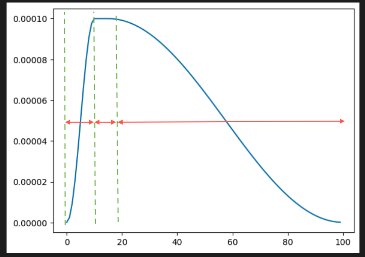

# GPT2-Two

Re-implementation of the GPT2 architecture (124M Parameters) based on the GPT-2 and GPT-3 papers and following Karpathy's Neural Networks: Zero to Hero final episode.

## GPT-2 Implementation Details:

Classical Transformer architecture is used here with pre-norm layer normalization on top of the GPT-2 tokenizer (we used the one from tiktoken but I also rebuilt that one in : TBD). here are some hyperparameters we've used

| Hyperparameter| Value |
|----|---|
| Number of Layers (layer norm + Self attention + layer norm + MLP)  | 12 |
| Number of Attention Heads | 12 |
| Embedding dimension | 768 |
| Vocab size (from GPT2 tokenizer)| 50257 |
| Block Size | 1024 |
| Total parameters | 124M |

## Pre-training :
### Batch size and torch.parallel :
Training is implemented using Distributed data parallel module to allow parallel training on multiple cuda GPUs if available ofc,
as specified in the GPT-2 paper for our parameter size is of 0.5M
Here the only important thing is to make sure that our B * T does divide our training batch size (B being micro-batch size and T being sequence length), here, we used 64-long micro-batches of 1024 tokens
tokens which does divide the chosen 524288 (nice number, 2^19) batch size and hence allows to train 

Those numbers where chosen on the assumption that training would happen on exactly 8 GPUs, but if you have for-example 16 GPUs
it is fine to for example have 32-long micro-batches, as those running parallely on 16 GPUs would yeild the same 2^19-long batches
that 62-long micro batches would on 8 GPUs.\

### Learning rate :

We used, again as mentioned in the GPT-2 paper a cosine learning rate schedule with linear warmup with the following values :

| GPT3 Paper Hyperparams| Value |
|---|---|
| maximum learning rate | 1.8E-3 |
| minimum learning rate | max_lr * 0.1 |
| warmup steps (linear climb from min_lr to max_lr) | 715 |
| max steps | 19073 |
| training tokens | 10B tokens ~= 1 epoch |

### Training costs : 

We were not able to train that model as it would've costed around 100$'s worth of A100/H100 compute on Lambda which I was highkey
not willing to spend on a GPT2 rebuild

### Optimizer : 

AdamW is applied on all non-bias, non-layernorm tensors with our learning rate and the following betas = (0.9,0.95) and eps = 1E-8
as specified in the paper.

## Evaluation : 

### Sampling :
We evaluate the model by sampling Validation loss every 2500 steps and/or on last step, we also sample text from the model every 250 steps and/or on the last step, at tha same interval we also evaluate on the hellaswag benchmark (file from Karpathy's nanoGPT repo, I did not bother to implement the benchmark tbh) as well as train loss at every step (the master process logs into the log folder)

## Dataset : 

To train the model, we have used the fineweb_edu dataset (https://huggingface.co/datasets/HuggingFaceFW/fineweb-edu), 
We more specifically imported 100 shards of 100M tokens (10B tokens hence 1 epoch from our training rounds)

## Sources : 

Dataset : https://huggingface.co/datasets/HuggingFaceFW/fineweb-edu

hellaswag benchmark code : https://github.com/karpathy/build-nanogpt/blob/master/hellaswag.py

GPT2 Paper : https://cdn.openai.com/better-language-models/language_models_are_unsupervised_multitask_learners.pdf

GPT3 Paper : https://arxiv.org/pdf/2005.14165

hellaswag benchmark paper : https://arxiv.org/pdf/1905.07830

Karpathy GPT2 Rebuild tutorial : https://www.youtube.com/watch?v=l8pRSuU81PU&list=PLAqhIrjkxbuWI23v9cThsA9GvCAUhRvKZ&index=11

tiktoken library : https://github.com/openai/tiktoken
## Comments :

The Neural netowrks: Zero to Hero series from Karpathy on youtube is highkey goated to learn how to actually implements concepts from SGD and Neural nets to CNNs, BPE, Transformers, BN, LN and so many more concepts that in my experience sticks far better than 
just watching and taking notes from 3blue1Brown or StatQuest, which though high quality and very well explained/illustrated, don't stick as much in your brain as actually building it in PyTorch.
I'd also say it actually enables you to go ahead and start exploring other papers on your own this time (more often with Claude) which is I think empowering, as I learned a lot of cool/impressive stuff from other papers I read onwards of this series that I could have never onboarded onto without the specific paper-based teaching Karpathy uses in this series for most important concepts that are thaught which I think is really cool